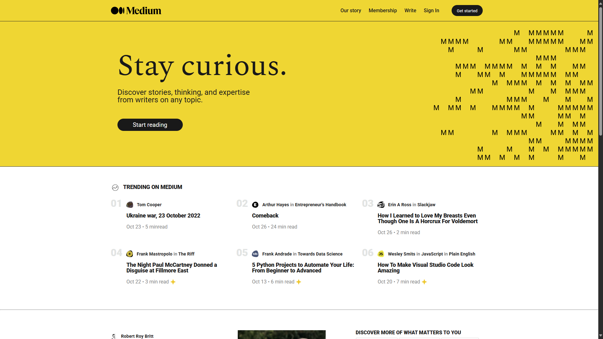
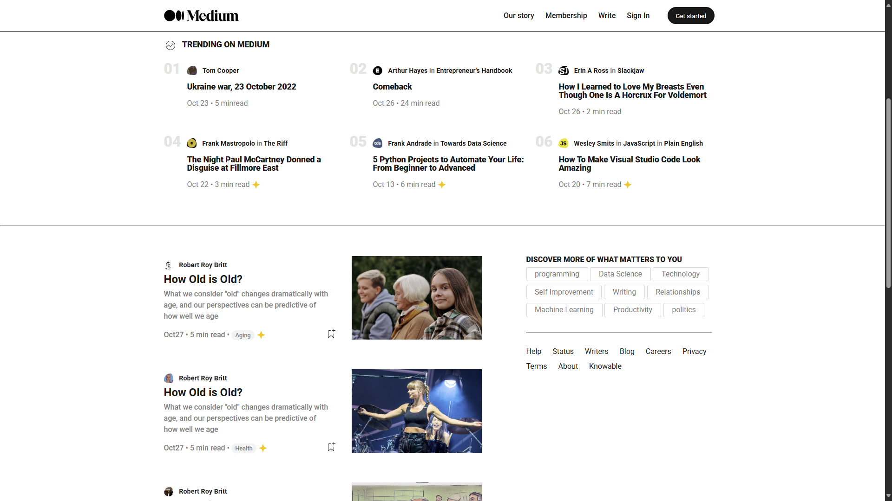
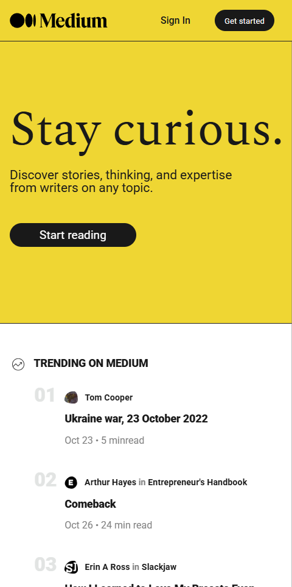

# 📰 Medium Homepage Clone – Vanilla HTML & CSS

Questo progetto è una **riproduzione fedele della homepage di Medium**, sviluppata con **HTML e CSS puri**, completamente **responsive** e senza alcun framework o libreria esterna.

---

## 🎯 Obiettivo

L’obiettivo era replicare il design di Medium:
- solo con **HTML semantico**
- **CSS custom**, senza Bootstrap o Tailwind
- layout responsive
- animazioni di base ed effetti hover

⏱️ **Tempo impiegato:** circa 7 ore  
🧪 _Progetto realizzato in un solo giorno come esercizio di UI/UX e codice pulito_

---

## 📸 Screenshot

